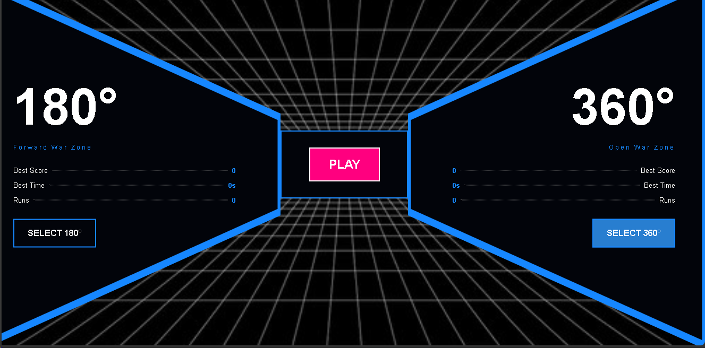
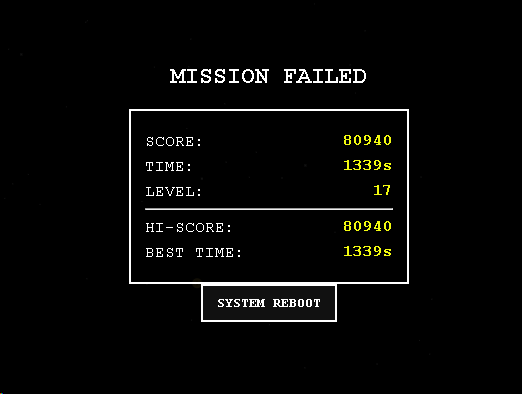

# Space War

It is a Fast-action arcade space shooter built with HTML5 + JavaScript. Two modes of play – defend the galaxy from the front line in 180° Mode or take on the full 360° Mode.
## Preview

 this is my best score try to beat it.

## Modes

180° Mode (Forward War Zone): enemies attack only from the front.Upgrade your forward firepower, keep your health intact and hold the front line against enemy scouts, fighters, heavy cruisers and bosses.
360° Mode (Open War Zone): no restrictions – enemies attack from all directions. Dodge enemy fire, roll across the screen, collect crystals to level up.

## Features

Custom upgrade system: level up during gameplay to unlock various upgrades such as Multi-Beam Cannons, damage boost, fire rate increase, speed boost and hull repair.
Boss battles: battle powerful bosses on specific levels.
Local storage leaderboard: track your high scores, survival time and total runs for both modes.
No external assets: built with pure HTML5, CSS3 and JavaScript with procedural Web Audio synthesis – no images or audio needed.

How to play:

Clone or download the repo to your local machine and unzip into a single folder
2.
Open
index.html
with your favorite browser
3. Choose the game mode and hit PLAY

Controls:

To Move Arrow keys / W A S D / on-screen joystick on mobile
To fire The ship will automatically fire at the nearest enemy.
To Pause P or Pause button
To Mute M or Sound button

## Project structure

`index.html` – the index file with the game modes selection and statistics.
`180-game.html` – the 180° game file.
`360-game.html` – the 360° game file.